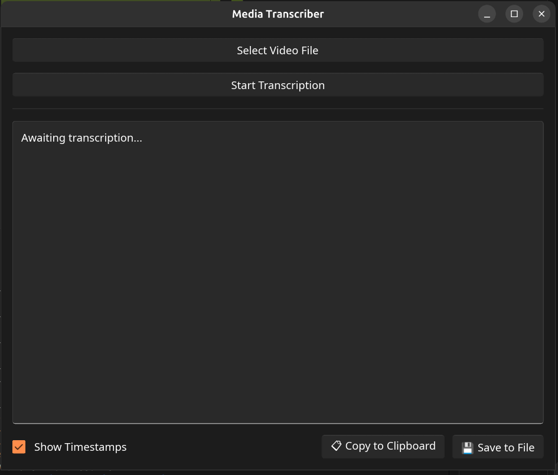

<div align="center">
  <h1>🎙️ Media Transcriber</h1>
  <p><strong>A fast, privacy-first desktop app that transcribes speech in video and audio files using Whisper, entirely on your own machine.</strong></p>

  
  
  
  
</div>

<br />

Pick a video or audio file, and Media Transcriber pulls out the audio and turns the speech into text using OpenAI's Whisper model running **100% locally**. No cloud APIs and no account; after the one-time model download it works fully offline.



## ✨ Features

* 🔒 **Local and private:** your files never leave your machine.
* 🌍 **Many languages:** the spoken language is detected automatically.
* 🎞️ **Almost any format:** MP4, MKV, MOV, AVI, WebM, MP3, WAV, M4A, FLAC, Ogg, Opus and more.
* ⏱️ **Timestamps:** toggle `[MM:SS.mmm]` markers on or off instantly, without re-processing.
* 📊 **Live progress** through decoding, model loading and transcription.
* 📋 **Easy export:** copy to the clipboard or save as a `.txt` file.
* 💻 **Command-line tool** for batch-transcribing many files.

## 📥 Installation

Download the file for your system from the [latest release](https://github.com/Leac1m/media-transcriber/releases/latest):

| System | File | Notes |
|---|---|---|
| **Windows** 10/11 (64-bit) | `…-setup.exe` | FFmpeg is included. |
| **macOS** Apple Silicon / Intel | `….dmg` | FFmpeg is included. Drag the app into Applications. |
| **Linux** (Debian/Ubuntu) | `….deb` | Install with `sudo apt install ./<file>.deb`, which also installs FFmpeg. |
| **Linux** (any distro) | `….AppImage` | Needs FFmpeg from your package manager. Run `chmod +x <file>.AppImage`, then launch it. |

On first launch the app offers to download the Whisper model (~465 MB, once). The download is checked against a SHA-256 checksum before use.

### "Unidentified developer" warnings

The releases are not code-signed yet, so your OS will warn you the first time:

* **Windows (SmartScreen):** click **More info → Run anyway**.
* **macOS (Gatekeeper):** open the app once, then go to **System Settings → Privacy & Security** and click **Open Anyway**.

## 💻 Usage

### Desktop app

1. Click **Select Video File** and choose a video or audio file.
2. Click **Start Transcription** and follow the progress bar.
3. Use **Show Timestamps** to toggle the time markers.
4. Click **📋 Copy to Clipboard** or **💾 Save to File**.

### Command line

```bash
media-transcriber-cli interview.mp4 lecture.mkv podcast.mp3
```

Each file's transcript, with timestamps, is written next to it as a `.txt` file (`interview.txt`, …). The model is loaded once and reused for every file.

## 🛠️ Building from source

**Requirements (all platforms):** [Rust](https://rustup.rs/) 1.92 or newer, CMake, a C/C++ compiler and libclang (used to build whisper.cpp), plus FFmpeg at runtime.

| System | Install the requirements |
|---|---|
| Debian/Ubuntu | `sudo apt install build-essential cmake clang ffmpeg` |
| Fedora | `sudo dnf install gcc-c++ cmake clang-devel ffmpeg-free` (or `ffmpeg` from RPM Fusion for more codecs) |
| macOS | `xcode-select --install`, then `brew install cmake ffmpeg` |
| Windows | [Visual Studio Build Tools](https://visualstudio.microsoft.com/visual-cpp-build-tools/) ("Desktop development with C++"), then `winget install Kitware.CMake LLVM.LLVM Gyan.FFmpeg` |

Then:

```bash
git clone https://github.com/Leac1m/media-transcriber.git
cd media-transcriber
cargo run --release                                          # desktop app
cargo run --release --bin media-transcriber-cli -- file.mp4  # command line
```

On Linux and macOS, `./install.sh` builds the app and installs it for your user (`~/.local/bin`, plus an app-menu entry on Linux).

## 🗂️ Where files are stored

| | Linux | macOS | Windows |
|---|---|---|---|
| Whisper model | `~/.local/share/media-transcriber/models/` | `~/Library/Application Support/media-transcriber/models/` | `%LOCALAPPDATA%\media-transcriber\models\` |
| Settings | `~/.config/media-transcriber/` | `~/Library/Application Support/media-transcriber/` | `%APPDATA%\media-transcriber\` |

To free the disk space after uninstalling, delete these folders.

## 🧱 Built with

* [Rust](https://www.rust-lang.org/): the core application.
* [Slint](https://slint.dev/): the native GUI toolkit.
* [whisper-rs](https://codeberg.org/tazz4843/whisper-rs): Rust bindings for [whisper.cpp](https://github.com/ggml-org/whisper.cpp).
* [FFmpeg](https://ffmpeg.org/): audio extraction and decoding.
* [rfd](https://github.com/PolyMeilex/rfd): native file dialogs.

## 🤝 Contributing

Issues and pull requests are welcome on the [issue tracker](https://github.com/Leac1m/media-transcriber/issues).

## 📝 License

Media Transcriber is licensed under the [GNU General Public License v3.0](LICENSE) or later.

The Whisper model is released by OpenAI under the MIT License. FFmpeg, included in the Windows and macOS releases, is licensed under the GPL; its license and a link to its source code come with those releases.
